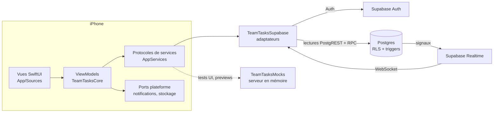

# Architecture

Ce document explique comment Équipe est construite et testée. Les règles précises (permissions, API, erreurs, signaux) sont dans [CONTRACTS.md](CONTRACTS.md), la référence commune à tout le code.

Contrainte de départ : **pas de Mac**. Une app SwiftUI ne se compile qu'avec Xcode sous macOS. On a donc mis le maximum de logique dans un package Swift **sans SwiftUI**, qui se compile et se teste sous Linux (Docker, sur Windows). Seules les vues restent réservées au Mac gratuit de GitHub Actions.

## Vue d'ensemble

## Modules

| Module | Contenu | Dépend de |
|---|---|---|
| `TeamTasksCore` | Modèles (`TaskItem`, `TeamGroup`, `Membership`…), protocoles de services (`AuthService`, `ProfileService`, `GroupService`, `TaskService`, `RealtimeService`, `PushService`), ports plateforme (`NotificationScheduler`, `KeyValueStore`), erreurs (`AppError`, messages en français, `BackendErrorMapper`), validation (`InputValidation`, `Limits`), permissions (`TaskPermissions`, `GroupPermissions`), logique pure (`TaskFilter`, `TaskSort`, `DueBucket`, `ReminderPlanner`, `AssignmentNotifier`, `ChangeFeed`, `RealtimeCoordinator`), ViewModels `@MainActor @Observable` | rien (ni SwiftUI, ni UIKit, ni Supabase) |
| `TeamTasksMocks` | `InMemoryBackend` : un faux serveur qui applique la même matrice de permissions que le SQL, les données de démo (`DemoData`, copie de `seed.sql`) et les scénarios `signedOut`, `populated`, `emptyGroups` | Core |
| `TeamTasksContract` | 56 scénarios qui décrivent le comportement attendu du serveur, écrits une fois et joués contre n'importe quelle implémentation | Core |
| `TeamTasksSupabase` | Implémentation des services sur Supabase : Auth et Realtime via supabase-swift (2.x), lectures et RPC via un petit client PostgREST maison | Core, supabase-swift |
| `App/` | Vues SwiftUI volontairement fines, navigation, adaptateurs iOS (`UNUserNotificationCenter`, `UserDefaults`, Background App Refresh), lecture de la configuration | les trois bibliothèques |
| `supabase/` | Migrations SQL (schéma, RLS, RPC, triggers, publication Realtime), seed, tests pgTAP | – |

Le projet Xcode n'est pas versionné : **XcodeGen** le génère depuis `project.yml` en CI.

## Démarrage et configuration

1. `project.yml` recopie dans l'`Info.plist` les réglages `SUPABASE_SCHEME`, `SUPABASE_HOST` et `SUPABASE_PUBLISHABLE_KEY`, pris dans `Config/Base.xcconfig` et surchargés par `Config/Secrets.xcconfig`. Ce dernier est généré par `scripts/write-secrets.mjs` à partir des Variables GitHub.
2. Au lancement, `AppEnvironment` choisit le serveur :
   - avec l'argument `-uiTestMockBackend` (et `-mockScenario <signedOut|populated|emptyGroups>`), c'est le serveur en mémoire, utilisé par les tests UI ;
   - sinon, c'est Supabase. `SupabaseSettings` valide la configuration et, si elle est incomplète, affiche l'écran « Configuration manquante » avec la liste des problèmes.
3. `AppModel` suit l'état de connexion. `RootView` affiche l'écran de démarrage, le parcours de connexion, les onglets (Groupes, Mes tâches, Réglages) ou l'étape « Nouveau mot de passe ».
4. Une connexion crée un `SessionModel` (un par utilisateur connecté). Il regroupe le `ChangeFeed`, le `RealtimeCoordinator`, l'`AssignmentNotifier` et le `ReminderSynchronizer`, et tout est arrêté et nettoyé à la déconnexion.

L'app n'a **aucun entitlement**, pour rester installable avec un Apple ID gratuit.

## Flux de données

**Lectures** : requêtes PostgREST (`GET /rest/v1/…`) listées dans [CONTRACTS.md §4.3](CONTRACTS.md#43-reads-postgrest). La RLS de Postgres filtre tout : on ne voit que ses groupes, leurs tâches et leurs membres.

**Écritures** : uniquement des **fonctions RPC** SQL (`create_task`, `set_task_status`, `join_group_by_code`…). Seule exception : le changement de nom affiché, qui passe par un `PATCH profiles`. Chaque RPC vérifie les droits, valide les données et fait tout en une transaction.

Exemple : créer une tâche assignée à Inès.
1. `TaskEditorView` → `TaskEditorViewModel.save()` : validation locale (`InputValidation`) et droits (`TaskPermissions`, miroir exact des règles SQL, qui sert à griser ce qui est interdit).
2. `TaskService.create` → RPC `create_task` : la tâche et ses assignés sont insérés ensemble. Toute erreur revient sous la forme `P0001 <code>` ou `42501 forbidden`, puis `BackendErrorMapper` la traduit en `AppError`, avec un message en français.
3. Dans la même transaction, un trigger met à jour la « colonne signal » `groups.last_activity_at`. L'insertion de la ligne `task_assignees` d'Inès sert elle-même de signal.
4. Realtime prévient les membres du groupe et Inès (section suivante). Leurs écrans se rechargent, et Inès reçoit une notification locale.

La sécurité est **garantie par le serveur**. Le miroir côté client ne sert qu'à l'ergonomie.

## Temps réel par signaux

Realtime ne transporte pas les données : il envoie seulement des **signaux** « quelque chose a changé ». L'app relit ensuite les données par PostgREST, donc à travers la RLS. Pourquoi ce choix :
- les événements `DELETE` de Realtime ne respectent pas la RLS : ils ne sont donc **pas publiés**, et la publication ne contient que `insert, update` ;
- un signal ne contient aucune donnée sensible, et une suppression se voit par le simple rechargement.

| Signal | Écoute (un seul canal par session) | Déclenché par |
|---|---|---|
| `UPDATE groups` (au plus 60 groupes) | `id=in.(mes groupes)` | Toute écriture sur les tâches, les assignés ou les membres du groupe, ou un renommage |
| `UPDATE profiles` | `id=eq.<moi>` | Mes adhésions changent (arrivée, départ, rôle), ou mon nom affiché change |
| `INSERT task_assignees` | `user_id=eq.<moi>` | On m'assigne une tâche |

Côté app, `RealtimeCoordinator` reçoit les signaux et les regroupe (fenêtre de 300 ms) en « révisions » du `ChangeFeed`. Chaque ViewModel note la révision qu'il a chargée et se recharge quand elle change. Quand mes adhésions changent, le canal est rouvert avec la nouvelle liste de groupes. À chaque (re)connexion, ainsi qu'au retour au premier plan, `bumpAll()` fait tout recharger, pour ne rien manquer pendant une coupure.

## Notifications

Rappels d'échéance (`ReminderPlanner`, au plus 60 en attente) et alertes d'assignation (`AssignmentNotifier`, dédoublonnage entre le temps réel et le rattrapage) sont des notifications **locales**. Voir [NOTIFICATIONS.md](NOTIFICATIONS.md) pour le fonctionnement, les limites et l'option ntfy.

## Stratégie de test

| Couche | Outil | Où ça tourne |
|---|---|---|
| Base : schéma, grants, RLS, RPC, triggers, signaux | **pgTAP** (`supabase/tests/database`, 9 fichiers, 409 tests) | `npm run db:test` ; job CI *Database* |
| Logique et ViewModels | Swift Testing, avec le serveur en mémoire et une horloge simulée | Docker Linux `swift:6.3-noble` (`npm run swift:test`) ; CI Linux et macOS |
| Parité mocks ↔ SQL | **Scénarios de contrat** (`TeamTasksContract`) joués contre `InMemoryBackend` **et** contre les adaptateurs Supabase branchés sur le Supabase local | `npm run swift:it` ; job CI *Swift package* |
| Adaptateurs Supabase | Tests unitaires sur des réponses JSON enregistrées, puis intégration réelle : inscription, reset par code (lu dans **Mailpit**), temps réel (WebSocket sous Linux) | idem |
| App SwiftUI | Tests UI XCTest sur simulateur, avec le serveur en mémoire : parcours complets et **9 captures d'écran** | job CI *iOS* uniquement (macOS) |

Les scénarios de contrat sont la pièce centrale : si le faux serveur et le vrai divergent, un scénario échoue d'un côté. On peut alors tester les ViewModels et les écrans sur les mocks en toute confiance.

Sur Windows, les tests Swift tournent dans le conteneur Linux (`scripts/swift-docker.mjs`). En mode `it`, le conteneur rejoint le Supabase local lancé par la CLI. En CI, le job iOS génère le projet avec XcodeGen, lance les tests UI, publie les captures (artifact et branche `ci-screenshots`), puis construit l'IPA non signée.

## Faire évoluer le code

- Toute règle qui change passe d'abord par **CONTRACTS.md**, puis par le SQL, les mocks, les adaptateurs, et leurs tests, dans la même modification.
- Le schéma ne change que par une **nouvelle migration**, horodatée après `20260924000300`. Les migrations déjà appliquées au projet hébergé sont figées (voir [SUPABASE.md](SUPABASE.md#2-envoyer-le-schéma-de-la-base-migrations)).
- Les vues restent fines : la logique va dans `TeamTasksCore`, où elle est testable sans Mac.
- Commentaires du code en anglais, textes visibles en français. Fichiers en UTF-8 sans BOM, fins de ligne LF (imposées par `.gitattributes`).
